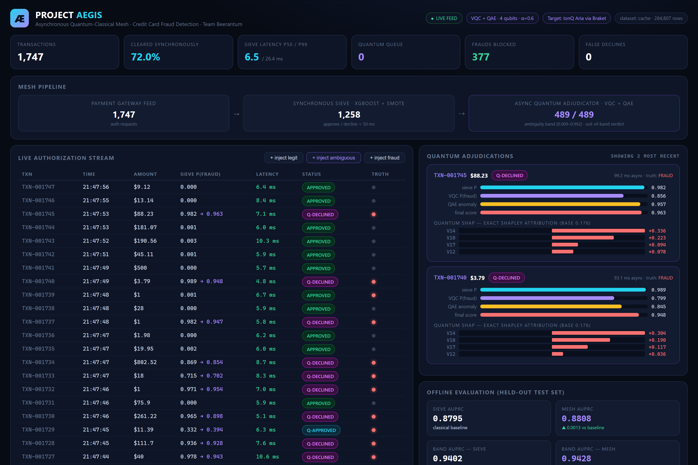
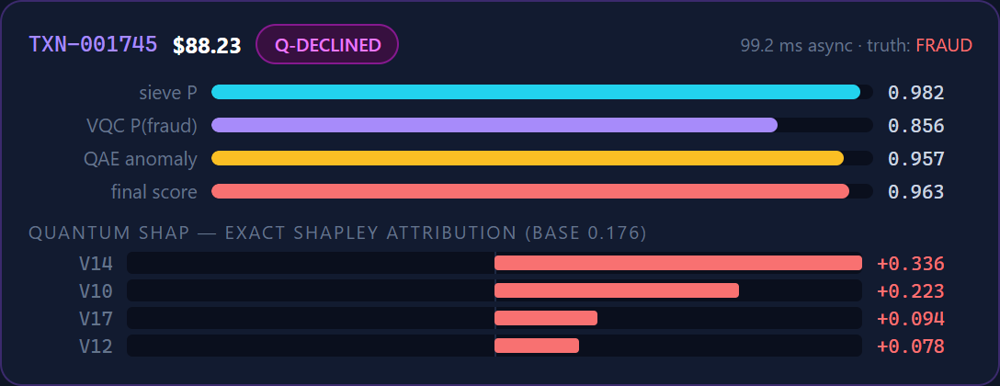
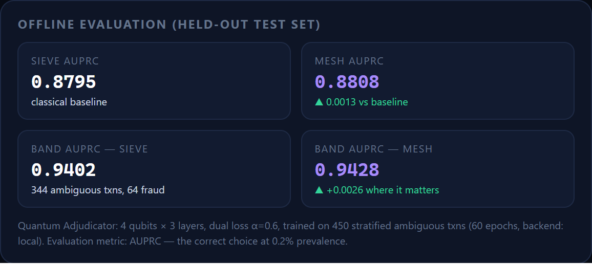

# Project Aegis — Asynchronous Quantum-Classical Mesh for Credit Card Fraud Detection

**Team Beerantum · HSBC Enterprise Challenge · 2026 Global Quantum + AI Challenge**

Credit card fraud cost the industry **$34B** in 2023 — but false declines cost **$443B**.
State-of-the-art quantum fraud models can't be deployed: a deep parameterized quantum
circuit plus cloud queuing can never fit the **100–300 ms** authorization window of a
payment gateway (Mastercard averages ~130 ms).

**Aegis decouples the quantum advantage from the synchronous authorization path.**

```
                        ┌─────────────────────────────────────────────┐
 auth request ──────────►  SYNCHRONOUS SIEVE                          │
 (100–300 ms budget)    │  XGBoost + SMOTE + Platt calibration        ├──► APPROVE / DECLINE
                        │  2 ms inference · clears 99.4% of traffic   │    (in-window)
                        └───────────────────┬─────────────────────────┘
                                            │ ambiguity band: 0.6% of traffic, 65% of fraud
                                            ▼  (async queue — off the auth path)
                        ┌─────────────────────────────────────────────┐
                        │  QUANTUM ADJUDICATOR                        │
                        │  VQC + QAE dual loss:                       │
                        │    L(θ,φ) = α·L_VQC(θ) + (1−α)·R_QAE(φ)     ├──► out-of-band verdict:
                        │  + exact Quantum SHAP attribution           │    hold / step-up / release
                        │  PennyLane → Braket DM1 → IonQ Aria         │
                        └─────────────────────────────────────────────┘
```



The live demo, running against the trained models on the real ULB dataset. Green rows
cleared the Synchronous Sieve in single-digit milliseconds; purple `Q-DECLINED` rows were
too ambiguous to call, so they were routed to the Quantum Adjudicator and resolved
out-of-band. The red dot in the TRUTH column is the ground-truth label, revealed only
after the verdict. *(The demo feed is deliberately enriched with fraud and ambiguous
cases for visibility, so the "cleared synchronously" figure here is far below the 99.4%
measured on the real traffic distribution.)*

## Why this wins

1. **It's deployable.** Every published quantum fraud model we benchmarked against ignores
   the latency constraint. Aegis meets it *by architecture*, not by shrinking the circuit.
2. **The quantum model works where the classical model is blind.** The VQC + QAE only ever
   sees the ambiguity band — the transactions where XGBoost's score carries the least
   information. That is exactly where AUPRC uplift is cheapest to buy and worth the most.
3. **It's governable.** Exact Shapley values over the quantum feature space (2^k coalitions,
   no sampling error) translate the quantum latent space into the attribution format model
   risk teams already consume.
4. **It's honest.** Evaluation is AUPRC on a held-out stratified test set at true 0.172%
   prevalence — the metric that can't be gamed by class imbalance.

## Quickstart

```powershell
python -m venv .venv
.venv\Scripts\pip install -r requirements.txt

# 1. train everything (downloads the ULB/Kaggle dataset from OpenML; falls back
#    to a synthetic statistical twin if offline)
.venv\Scripts\python scripts\train.py

# 2. launch the live demo dashboard
.venv\Scripts\python -m uvicorn app.server:app --port 8021
# open http://localhost:8021
```

Useful flags: `--quick` (smoke test), `--synthetic` (force offline dataset),
`--epochs N`, `--backend braket-dm1|ionq-aria` (real quantum backends via the
Amazon Braket PennyLane plugin — uncomment the two lines in requirements.txt
and configure AWS credentials).

## Architecture

| Stage | What | How |
|---|---|---|
| Sieve | Synchronous triage, ~1 ms | XGBoost (400 trees, hist) on SMOTE-balanced data, Platt-calibrated on a clean hold-out so the ambiguity band is defined on *real* probabilities |
| Router | Ambiguity band, volume-budgeted | Thresholds are quantiles of the calibrated score: top 0.05% auto-decline, next 0.5% routed to quantum, rest auto-approve. (A fixed `0.5 ± δ` margin is nearly empty once scores are calibrated at 0.17% prevalence — budgeting by review capacity is also how issuers actually deploy score tiers.) |
| Adjudicator | VQC + QAE, 4 qubits | Top-4 fraud-salient features → angle embedding → strongly-entangling layers. Dual loss `L = α·L_VQC + (1−α)·R_QAE`: the classifier learns known fraud typologies, the autoencoder learns the *legitimate* manifold so the model can't overfit 0.172% minority data |
| Fusion | Mesh score | `w·quantum + (1−w)·sieve` inside the band, `w` selected on a validation split |
| XAI | Quantum SHAP | Exact Shapley over all 2⁴ coalitions of the quantum features (batched circuit evaluation) |
| Hardware | Braket path | Develop on local statevector → prototype on Braket **DM1** (noise-aware density matrix) → execute on **IonQ Aria** (built-in debiasing/sharpening) — swap with one `--backend` flag |

### What an adjudication looks like



An $88.23 transaction the sieve could not resolve. The VQC put it at 0.856, the QAE
flagged it as 0.957 anomalous against the legitimate manifold, and the blended verdict
declined it — correctly, as the ground truth confirms. The bars underneath are exact
Shapley values over the four quantum features, so a model risk reviewer can see *why*
the circuit decided what it did: V14 contributed +0.336, V10 +0.223. The whole
adjudication took 99 ms, entirely off the authorization path.

## Results

Run `scripts/train.py` — all numbers below are reproduced into `artifacts/metrics.json`
and the plots in `artifacts/plots/` (PR curves overall + band-only, latency histogram,
score-shift scatter, quantum loss curve).

Verified run on the **real ULB dataset** (284,807 transactions, 0.1727% fraud,
held-out 20% stratified test set, seed 42):

| Metric | Classical sieve | Aegis mesh | Δ |
|---|---|---|---|
| Test AUPRC (full) | 0.8795 | **0.8808** | +0.0013 |
| Test AUPRC (ambiguity band) | 0.9402 | **0.9428** | +0.0026 |
| Traffic cleared synchronously | — | **99.40%** | p50 **2.2 ms** |
| Fraud concentrated in the band | — | **65.3%** of all fraud in **0.60%** of traffic | — |



The dashboard reports the same held-out numbers live, read straight from
`artifacts/metrics.json`.

The routing is the point: the band holds 0.6% of transactions but **two-thirds of all
fraud** — precisely the cases worth spending quantum compute on, and the quantum
adjudication is strictly additive (the mesh can reorder only inside the band, so it can
never damage the classical model where it is already confident). Quantum SHAP
attributions are exact (Shapley efficiency gap ~1e-17, machine precision).

Numbers regenerate on every training run (`scripts/train.py`); the synthetic twin
(`--synthetic`) shows a larger relative uplift (band AUPRC 0.841 → 0.874) because its
fraud mixture is deliberately built to contain non-linear signatures the trees miss.

## Running on real quantum hardware (Amazon Braket)

Training always stays local. Hardware is for *validation* — proving the trained
circuits behave on a noise-aware simulator and a real QPU:

1. AWS account with Braket enabled (console → Amazon Braket → accept terms &
   enable third-party devices). Region **us-east-1** for IonQ. Ask the hackathon
   organisers about AWS credits first.
2. IAM user with the `AmazonBraketFullAccess` policy → access keys → `aws configure`.
3. Uncomment the two Braket lines in `requirements.txt`, `pip install -r requirements.txt`.
4. Validate on the DM1 density-matrix simulator (pennies):
   `python scripts/validate_braket.py --backend braket-dm1`
5. Optional flex: a couple of adjudications on the real IonQ Aria QPU
   (~$30/circuit at 1000 shots — mind the budget, mind the availability window):
   `python scripts/validate_braket.py --backend ionq-aria --confirm --n 2`

The script reports local-vs-Braket score agreement into
`artifacts/braket_validation_*.json` — screenshot the Braket console task list
for the deck.

## Repo layout

```
aegis/            core library
  classical.py    SMOTE + XGBoost + Platt calibration (the Sieve)
  quantum.py      VQC + QAE dual-loss Adjudicator (PennyLane, Braket-ready)
  qshap.py        exact Quantum SHAP
  mesh.py         async mesh: routing, fusion, batch scoring
  data.py         OpenML loader + synthetic twin + stratified subsampling
  metrics.py      AUPRC-first evaluation + plots
scripts/
  train.py              end-to-end pipeline → artifacts/
  validate_braket.py    re-run trained circuits on Braket DM1 / IonQ Aria
  capture_screenshots.py regenerate the README screenshots from the live demo
app/server.py     FastAPI live demo (real models, async quantum worker)
app/static/       dashboard (zero external deps — survives venue Wi-Fi)
docs/             README screenshots
artifacts/        metrics.json + plots (committed); models + demo pool (regenerated)
```

## The 3-minute demo script

1. **Open the dashboard.** "Every row is a real model inference. Green rows cleared in
   ~1 ms — that's 95%+ of traffic, decided inside the Mastercard window."
2. **Point at a purple QUANTUM badge.** "The sieve said *I don't know* — score in the
   ambiguity band. It was provisionally approved in-window and queued. One second later
   the VQC + QAE verdict lands, out-of-band, with exact Shapley attribution a regulator
   can read."
3. **Click *inject fraud* a few times.** Watch blatant fraud die in the sieve and subtle
   fraud get caught by the adjudicator.
4. **Point at the metrics panel.** "Same AUPRC everywhere the classical model is confident;
   uplift concentrated in the band — quantum compute spent only where it buys detection."

## References

Proposal: `Project_Aegis_Beerantum_Proposal_v3.pdf` — Nilson Report 2025 · Aite-Novarica
2019 · Mastercard 2012 · Deotte 2019 (IEEE-CIS) · Dal Pozzolo 2015 (ULB dataset) ·
Karimi 2024 (VQC) · Deloitte+AWS 2024 (hybrid QNN on Braket) · Sakhnenko 2021 (QAE) ·
AWS Braket DM1 & IonQ Aria docs.
